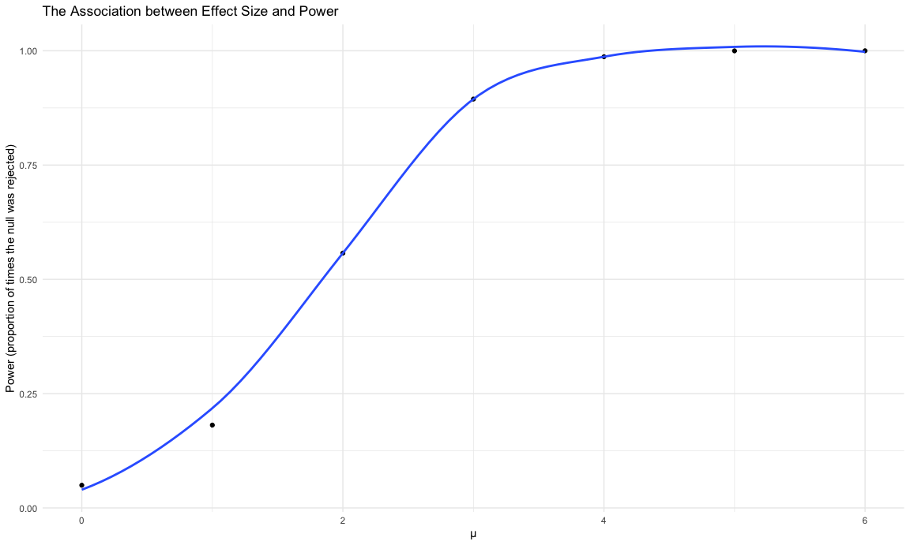
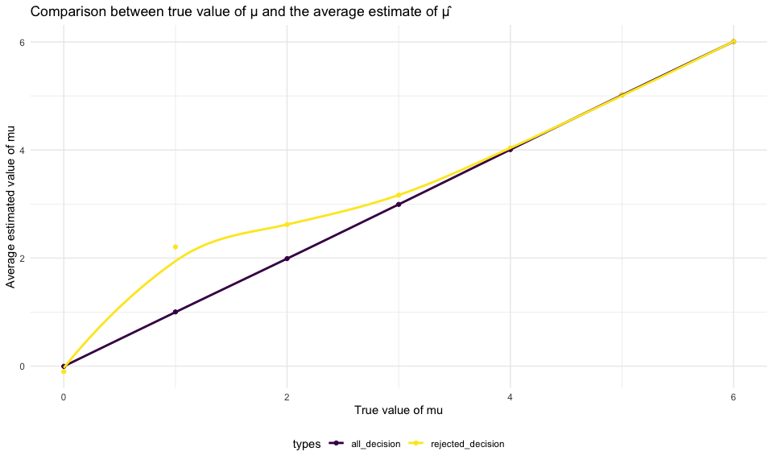

P8105 - Homework 5
================
Linh Tran
11/12/2020

# Problem 1

Read in the data

``` r
homicide_data = read_csv("homicide_data/homicide-data.csv")
```

The raw data has information on homicides in 50 large US cities gathered
by the *Washington Post* , including victims’ information (name, race,
age, sex), location where the homicide occured (city, state) and
disposition (closed/open with or without arrest).

Create a `city_state` variable

``` r
homicide_df = 
  homicide_data %>% 
  mutate(
    city_state = str_c(city, state, sep = "_"),
    resolved = case_when(
      disposition == "Closed without arrest"  ~ "unsolved",
      disposition == "Open/No arrest"         ~ "unsolved",
      disposition == "Closed by arrest"       ~ "solved",
    )
  ) %>% 
  select(city_state, resolved)
```

Summarize within cities to obtain the total number of homicides and the
number of unsolved homicides.

``` r
aggregate_df =
  homicide_df %>% 
  group_by(city_state) %>% 
  summarize(
     hom_total = n(),
     hom_unsolved = sum(resolved == "unsolved", na.rm = TRUE), 
  ) %>% 
  filter(city_state != "Tulsa_AL")   #Tulsa is in OK, not in AL
```

    ## `summarise()` ungrouping output (override with `.groups` argument)

For the city of Baltimore, MD, use the prop.test function to estimate
the proportion of homicides that are unsolved; save the output of
prop.test as an R object, apply the broom::tidy to this object and pull
the estimated proportion and confidence intervals from the resulting
tidy dataframe.

``` r
prop.test(
  aggregate_df %>%  filter(city_state == "Baltimore_MD") %>% pull(hom_unsolved),
  aggregate_df %>% filter(city_state == "Baltimore_MD") %>% pull(hom_total)
)  %>% 
  broom::tidy()
```

    ## # A tibble: 1 x 8
    ##   estimate statistic  p.value parameter conf.low conf.high method    alternative
    ##      <dbl>     <dbl>    <dbl>     <int>    <dbl>     <dbl> <chr>     <chr>      
    ## 1    0.646      239. 6.46e-54         1    0.628     0.663 1-sample… two.sided

Try to iterate using map function

``` r
results_df = 
  aggregate_df %>% 
  mutate(
    prop_tests = map2(.x = hom_unsolved, .y = hom_total, ~ prop.test(x = .x, n = .y)),
    tidy_tests = map(.x = prop_tests, ~broom::tidy(.x))
  )  %>% 
  select(-prop_tests) %>% 
  unnest(tidy_tests) %>% 
  select(city_state, estimate, conf.low, conf.high)
```

Plot showing the estimates and CIs for each city

``` r
results_df %>% 
  mutate(city_state = fct_reorder(city_state, estimate)) %>% 
  ggplot(aes(x = city_state, y = estimate)) +
  geom_point() +
  geom_errorbar(aes(ymin = conf.low, ymax = conf.high)) +
  theme(axis.text.x = element_text(angle = 90, vjust = 0.5, hjust =1))
```


Another solution

``` r
city_prop_test = function(df) {
  n_unsolved...
  n_total...
  prop.test(....)
}
```

# Problem 2

## Tidy dataframe

**Tidy dataframe containing data from all participants (subject ID, arm,
observations over time)**

``` r
# Import one dataset
data_1 = read_csv("lda_data/con_01.csv")

# Import all dataset
lda_df = 
  tibble(
    path = list.files("lda_data") 
  ) %>% 
  mutate(
    path = str_c("lda_data/", path),
    data = map(path, read_csv),
    path = str_replace(path, "^lda_data/", ""),
    path = str_replace(path, ".csv$", "")
  ) %>% 
  separate(path, into = c("arm", "subject_id"), sep = "_") %>% 
  unnest(data) %>% 
  pivot_longer(week_1:week_8,
               names_to = "week",
               values_to = "observation"
  ) %>% 
  mutate(
    week = as.numeric(str_replace(week, "^week_", "")),
    arm = recode_factor(arm,"con" = "control", "exp" = "experiment")
    ) 

lda_df
```

    ## # A tibble: 160 x 4
    ##    arm     subject_id  week observation
    ##    <fct>   <chr>      <dbl>       <dbl>
    ##  1 control 01             1        0.2 
    ##  2 control 01             2       -1.31
    ##  3 control 01             3        0.66
    ##  4 control 01             4        1.96
    ##  5 control 01             5        0.23
    ##  6 control 01             6        1.09
    ##  7 control 01             7        0.05
    ##  8 control 01             8        1.94
    ##  9 control 02             1        1.13
    ## 10 control 02             2       -0.88
    ## # … with 150 more rows

## Spaghetti plot

**A spaghetti plot showing observations on each subject over time, and
comment on differences between groups.**

``` r
lda_df %>% 
  ggplot(aes(x = week, y = observation, color = subject_id, linetype = arm)) +
  geom_line() +
  labs(x = "Week",
       y = "Observation",
       title = "Observations for each subject over eight week period")
```


**Comment**: Observations for the control group and experimental group
have roughly similar entry points. However, over time observations for
subjects in the experimental arm steadily increases while the subjects
from the control arms stay fairly constant over the eight week period.
In general, at the end week 8, the experimental arm has higher observed
values than control arm.

# Problem 3

## Simulate data

**Set μ = 0. Generate 5000 datasets from x \~ Normal\[μ,σ\]**

``` r
set.seed(1)

sim_ttest = function(mu) {
  
  sim_data = tibble(
    x = rnorm(n = 30, mean = mu, sd = 5),
  )
  
  sim_data %>% 
  t.test(mu = 0, alternative = "two.sided", conf.level = 0.95) %>% 
    broom::tidy() %>% 
    select(estimate, p.value)
}

# 5000 datasets for mu = 0
sim_ttest_0 = 
  rerun(5000, sim_ttest(0)) %>% 
  bind_rows()
```

**Repeat the above for μ={1,2,3,4,5,6}**

``` r
sim_results = 
  tibble(
  mu = c(0:6)
) %>% 
  mutate(
    output = map(.x = mu, ~rerun(5000, sim_ttest(mu = .x))),
    results = map(output, bind_rows)
    ) %>% 
  select(-output) %>% 
  unnest(results)

sim_results 
```

    ## # A tibble: 35,000 x 3
    ##       mu estimate p.value
    ##    <int>    <dbl>   <dbl>
    ##  1     0    0.520   0.549
    ##  2     0    1.11    0.188
    ##  3     0    1.01    0.220
    ##  4     0   -0.835   0.309
    ##  5     0   -0.892   0.365
    ##  6     0    0.557   0.503
    ##  7     0    1.04    0.238
    ##  8     0    1.40    0.144
    ##  9     0    1.15    0.180
    ## 10     0   -0.500   0.634
    ## # … with 34,990 more rows

## Plots

### Plot 1

**Plot showing the proportion of times the null was rejected (the power
of the test) on the y axis and the true value of μ on the x axis**

``` r
decision_df =
  sim_results %>% 
  mutate(
    decision = case_when(
      p.value < 0.05 ~ "reject",
      p.value >= 0.05 ~ "fail to reject"
    )
  ) %>% 
  group_by(mu) %>% 
  summarize(
    decision_total = n(),
    decision_reject = sum(decision == "reject")
  ) %>% 
  mutate(
    prop_tests = map2(.x = decision_reject, .y = decision_total, ~prop.test(x = .x, n = .y)),
    tidy_tests = map(.x = prop_tests, ~broom::tidy(.x))
  ) %>% 
  unnest(tidy_tests)
```

    ## `summarise()` ungrouping output (override with `.groups` argument)

``` r
decision_df %>%
  ggplot(aes(x = mu, y = estimate)) +
  geom_point() +
  geom_smooth(se = FALSE) +
  labs(
    x = "μ",
    y = "Power (proportion of times the null was rejected)",
    title = "The Association between Effect Size and Power"
  )
```

    ## `geom_smooth()` using method = 'loess' and formula 'y ~ x'



**Comment on plot 1**: As the effect size increases, the power
increases. Under the null hypothesis of mu = 0, as the effect size (mu)
increases from 1 to 6, the power to reject the null hypothesis also
increases because the difference between the null mu value (0) and the
true value of mu increases.

### Plot 2

**Plot showing the average estimate of μ̂ on the y axis and the true
value of μ on the x axis **

``` r
decision_all =
  sim_results %>% 
  group_by(mu) %>% 
  summarize(all_decision = mean(estimate))
```

    ## `summarise()` ungrouping output (override with `.groups` argument)

``` r
decision_reject =
  sim_results %>% 
  filter(p.value < 0.05) %>% 
  group_by(mu) %>% 
  summarize(rejected_decision = mean(estimate))
```

    ## `summarise()` ungrouping output (override with `.groups` argument)

``` r
# Combine plots

left_join(decision_all, decision_reject, by = "mu") %>%
  pivot_longer(
    all_decision:rejected_decision,
    names_to = "types",
    values_to = "average_estimated_mu"
  ) %>% 
  ggplot(aes(x = mu, y = average_estimated_mu, color = types)) +
  geom_point() +
  geom_smooth(se = FALSE) +
  labs(
    x = "True value of mu",
    y = "Average estimated value of mu",
    title = "Comparison between true value of μ and the average estimate of μ̂"
  )
```

    ## `geom_smooth()` using method = 'loess' and formula 'y ~ x'



**Comment on plot 2**: The average estimated value of mu for tests in
which the null was rejected are higher than the true value of mu and
then become approximately equal to true value of mu for mu \>= 3. This
makes sense because the power of the test increases as the effect size
increases, at a true mu of 4-6, the rejected mu hat is equal to the
average mu hat in all decision because we would have a 100% rejection
rate.
