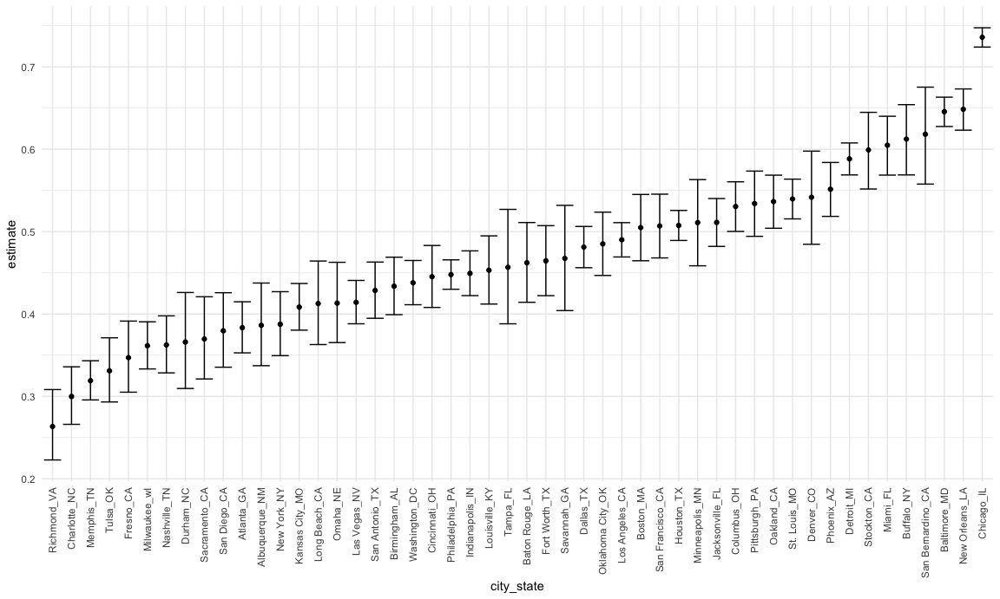
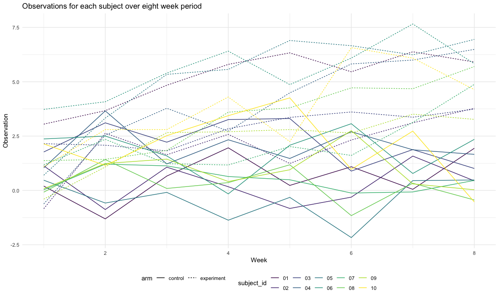

P8105 - Homework 5
================
Linh Tran
11/12/2020

# Problem 1

Read in the data

``` r
homicide_data = read_csv("homicide_data/homicide-data.csv")
```

The raw data has information on homicides in 50 large US cities gathered
by the *Washington Post* , including victims’ information (name, race,
age, sex), location where the homicide occured (city, state) and
disposition (closed/open with or without arrest).

Create a `city_state` variable

``` r
homicide_df = 
  homicide_data %>% 
  mutate(
    city_state = str_c(city, state, sep = "_"),
    resolved = case_when(
      disposition == "Closed without arrest"  ~ "unsolved",
      disposition == "Open/No arrest"         ~ "unsolved",
      disposition == "Closed by arrest"       ~ "solved",
    )
  ) %>% 
  select(city_state, resolved)
```

Summarize within cities to obtain the total number of homicides and the
number of unsolved homicides.

``` r
aggregate_df =
  homicide_df %>% 
  group_by(city_state) %>% 
  summarize(
     hom_total = n(),
     hom_unsolved = sum(resolved == "unsolved", na.rm = TRUE), 
  ) %>% 
  filter(city_state != "Tulsa_AL")   #Tulsa is in OK, not in AL
```

    ## `summarise()` ungrouping output (override with `.groups` argument)

For the city of Baltimore, MD, use the prop.test function to estimate
the proportion of homicides that are unsolved; save the output of
prop.test as an R object, apply the broom::tidy to this object and pull
the estimated proportion and confidence intervals from the resulting
tidy dataframe.

``` r
prop.test(
  aggregate_df %>%  filter(city_state == "Baltimore_MD") %>% pull(hom_unsolved),
  aggregate_df %>% filter(city_state == "Baltimore_MD") %>% pull(hom_total)
)  %>% 
  broom::tidy()
```

    ## # A tibble: 1 x 8
    ##   estimate statistic  p.value parameter conf.low conf.high method    alternative
    ##      <dbl>     <dbl>    <dbl>     <int>    <dbl>     <dbl> <chr>     <chr>      
    ## 1    0.646      239. 6.46e-54         1    0.628     0.663 1-sample… two.sided

Try to iterate using map function

``` r
results_df = 
  aggregate_df %>% 
  mutate(
    prop_tests = map2(.x = hom_unsolved, .y = hom_total, ~ prop.test(x = .x, n = .y)),
    tidy_tests = map(.x = prop_tests, ~broom::tidy(.x))
  )  %>% 
  select(-prop_tests) %>% 
  unnest(tidy_tests) %>% 
  select(city_state, estimate, conf.low, conf.high)
```

Plot showing the estimates and CIs for each city

``` r
results_df %>% 
  mutate(city_state = fct_reorder(city_state, estimate)) %>% 
  ggplot(aes(x = city_state, y = estimate)) +
  geom_point() +
  geom_errorbar(aes(ymin = conf.low, ymax = conf.high)) +
  theme(axis.text.x = element_text(angle = 90, vjust = 0.5, hjust =1))
```



Another solution

``` r
city_prop_test = function(df) {
  n_unsolved...
  n_total...
  prop.test(....)
}
```

# Problem 2

**Tidy dataframe containing data from all participants (subject ID, arm,
observations over time)**

``` r
# Import one dataset
data_1 = read_csv("lda_data/con_01.csv")

# Import all dataset
lda_df = 
  tibble(
    path = list.files("lda_data") 
  ) %>% 
  mutate(
    path = str_c("lda_data/", path),
    data = map(path, read_csv),
    path = str_replace(path, "^lda_data/", ""),
    path = str_replace(path, ".csv$", "")
  ) %>% 
  separate(path, into = c("arm", "ID"), sep = "_") %>% 
  unnest(data) %>% 
  pivot_longer(week_1:week_8,
               names_to = "week",
               values_to = "observation"
  ) %>% 
  mutate(week = as.numeric(str_replace(week, "^week_", ""))) 
```

**Make a spaghetti plot showing observations on each subject over time,
and comment on differences between groups.**

``` r
lda_df %>% 
  ggplot(aes(x = week, y = observation, group = ID)) +
  geom_point() +
  geom_line()
```



# Problem 3

Set elements

``` r
n = 30
sigma = 5
mu = 0
```

Generate 5000 datasets from x \~ Normal(mu, sigma). For each dataset,
save μ̂ and the p-value arising from a test of H:μ=0 using α=0.05. Hint:
to obtain the estimate and p-value, use broom::tidy to clean the output
of t.test.

``` r
function(samp_size, mu = 3, sigma = 4)  {
  sim_data = 
    tibble(
      x = rnorm(n = samp_size, mean = mu, sd = sigma)
    )
  sim_data %>% 
    summarize(
      mean = mean(x),
      sd = sd(x)
    )
}
```

    ## function(samp_size, mu = 3, sigma = 4)  {
    ##   sim_data = 
    ##     tibble(
    ##       x = rnorm(n = samp_size, mean = mu, sd = sigma)
    ##     )
    ##   sim_data %>% 
    ##     summarize(
    ##       mean = mean(x),
    ##       sd = sd(x)
    ##     )
    ## }

Repeat the above for μ={1,2,3,4,5,6}, and complete the following:

Make a plot showing the proportion of times the null was rejected (the
power of the test) on the y axis and the true value of μ on the x axis.
Describe the association between effect size and power. Make a plot
showing the average estimate of μ̂ on the y axis and the true value of μ
on the x axis. Make a second plot (or overlay on the first) the average
estimate of μ̂ only in samples for which the null was rejected on the y
axis and the true value of μ on the x axis. Is the sample average of μ̂
across tests for which the null is rejected approximately equal to the
true value of μ? Why or why not?

``` r
mu_list = 
  list(
    "mu = 1" = 1,
    "mu = 2" = 2,
    "mu = 3" = 3,
    "mu = 4" = 4,
    "mu = 5" = 5,
    "mu = 6" = 6
  )
```
